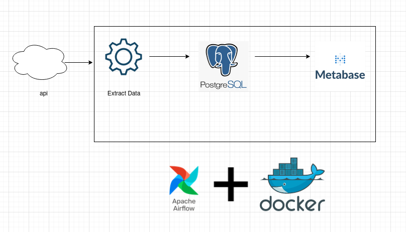

# StockETL
### To run docker-compose
```bash
docker-compose up -d
```

Than can access the airflow UI on http://localhost:8080 with credentials `airflow:airflow`

For now one has to trigger the whole dag workflow manually.

### The whole flow would be like,



### What is being done?

1. Scrape data.
2. Load data into Postgresql database.
3. One has to connect Postgres database first and further create dashboards in Metabase manually by connecting it with Postgresql database which contains the stock data.
4. Orchestrate and schedule with Apache Airflow in Docker.

### For metabase
- To add Postgres as a connector you can visit the documentation link https://www.metabase.com/docs/latest/databases/connections/postgresql

- To add dashboard in Metabase, you can visit the documentation link https://www.metabase.com/docs/latest/dashboards/introduction
